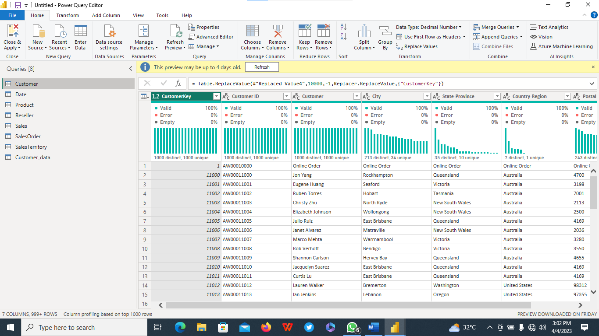

# SelCheapy-Stores Profitability

## Introduction:
This is a PowerBI Project that Analysis the Profitability of **SelCheapy Stores**, a fictitious topmost Store that sells Bike and Accessories through Resellers that are spread across Europe, North America and Pacifics. Also, through direct Online Order by Customers.

## Problem Statement:
Over time, the Store decides to review its business model of using Resellers vis a vis direct online Order by Customers, as well as its Profitability over Four (4) Business Years cycle. This information will help them to rejig their business modelin order to enhance their profitability.

## DataSet:
The Raw DataSet is the Excel Sales file of  AdentureWorks 2019 provided by Oyinbooke.

It contains Seven (7) Tables,namely:
1.  Sales Order Data
2.  Sales Territory Data
3.  Sales Data
4.  Reseller Data
5.  Date Data
6.  Product Data
7.  Customer Data

## Skills Demonstrated:
Data Cleaning,Data Exploratory and Joining Skills was brought to the fore to create a Consolidated Table called **_Sales Table_** base on Primary and Foreign Key relationship of the other Six (6) Tables.

## Data Transformation/Modelling:
Columns with missing values and wrong entry were identified. For example, The Reseller and Customer Table with missing values were Normalized and Standardized in line with other entries in the respective Table.
The Reseller ID Column (Primary Key) in the Reseller Table, with value of [Not Applicable] was normalized to AW00000000 and other Columns with [Not Applicable] were normalized to “Online Order”.

Reseller(Dirty) 

Reseller(Clean)

Also  CustomerID Column  in the Customer Table(Primary Key) with value [Not Applicable] was normalized to AW00010000 and other Columns with [Not Applicable] were
normalized to “Online Order”.

Customer(Dirty)

 

Customer(Clean)

 

Thereafter a Consolidates Sales table was created using the Primary /Foreign Key relationship to join all the Seven Tables using PowerBI query editor to transform the Dataset. Unnecessary Columns were removed.

Finally the Clean “Sales” Data was loaded into PowerBI for Annalysis.

## Analysis and Visualization:
The Report Comprises Two (2) Pages and Fourteen(14) Insights were created, namely:
1. Profit: 
2. Income by Region
3. Profit by Channel
4. Profit by Country
5. Profit by Year
6. Cost
7. Income
8 .Number of Customers
9. Number of Reseller
10. Number of Order
11. Income by Product Sub Category Top (5)
12. Income by Product
13. Income/Cost by Year
14. Top (10) Product by Income

You can interact with the Report [here] (https://app.powerbi.com/view?r=eyJrIjoiYzI2ZTE2YTctNGJiYS00MTY2LWFjYzEtMjlhMGJmMWFhNDVhIiwidCI6IjJlYWMyZjE5LTE1MWUtNGQzOC05NGUzLTlkYzg0YjYxNGJkNyIsImMiOjZ9)

## Conclusion/Recommendation:
For the Period under review, **SelCheapy** generated a whopping $13M in Profit with 96% of it coming from Customers that ordered Online.4% was from Resellers.

United States with over $4M, generated the highest Profit while Canada with Slightly over $1M generated the least.

The highest Selling Products by Category is Bike, especially the Mountain 200, Black 38.

The recommendation is **SelCheapy** should enhance the Online Order Process and wind down the Reseller as the bulk of their Profit is coming through the Online order platform.

